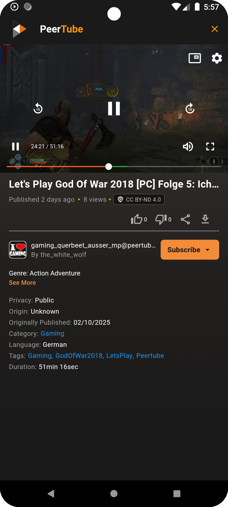

# **PeerTube Flutter App** 🎬📱

This is a **modern, fully-featured Flutter application** for browsing and playing videos from **PeerTube**, the decentralized video platform. The app is built using **Flutter & Dart**, integrating the **PeerTube API** to provide a smooth and native experience.

---

## **📌 Features** 🚀

✅ **Browse Videos** – Discover trending, latest, and local videos from PeerTube instances.  
✅ **Watch Videos** – Play all videos, including live streams.  
✅ **Interactive UI** – Modern and sleek design inspired by the original PeerTube interface.  
✅ **Comments Section** – View and interact with video comments.  
✅ **Channel & User Profiles** – Access detailed information about channels and creators.  
✅ **Search Functionality** – Find videos, channels, and more.  
✅ **Dark Mode** – Enjoy a fully optimized dark UI.  
✅ **Optimized Performance** – Uses caching, pagination, and efficient data fetching.

---

## **🛠 Tech Stack**

- **Flutter** – Cross-platform mobile development
- **PeerTube API SDK** – Connects with PeerTube's REST API
- **RiverPlayer** – Video player for seamless playback
- **Riverpod** – State management
- **Infinite Scroll Pagination** – Efficient video browsing
- **Cached Network Image** – Optimized image loading

---

## **📸 Screenshots**

| **Discover** | **Browse** | **Channel** |  
|-------------|-----------|------------|  
|  |  |  |  

| **Category** | **Video Player** | **Trending** |  
|-------------|---------------|-------------|  
|  |  |  |  

---

## **📌 Why This App?** 🤔

This project is **currently in active development**, showcasing how **Flutter can seamlessly integrate with PeerTube**. It serves as a **proof-of-concept** to demonstrate the potential of a **PeerTube + Flutter stack**, highlighting its efficiency and ease of implementation. New features and improvements are being added regularly. 🚀

---

## **🚀 How to Run the App?**

### 1️⃣ Clone the repository:
```bash
git clone https://github.com/RustLangLatam/peertube_app_flutter.git
cd peertube_app_flutter
```  

### 2️⃣ Install dependencies:
```bash
flutter pub get
```  

### 3️⃣ Run the app:
```bash
flutter run
```  

---

## **💡 Contribute & Support**

Contributions are welcome! Feel free to submit **issues, pull requests**, or suggest improvements.

🔗 **PeerTube + Flutter is the future of decentralized video on mobile!** 🚀